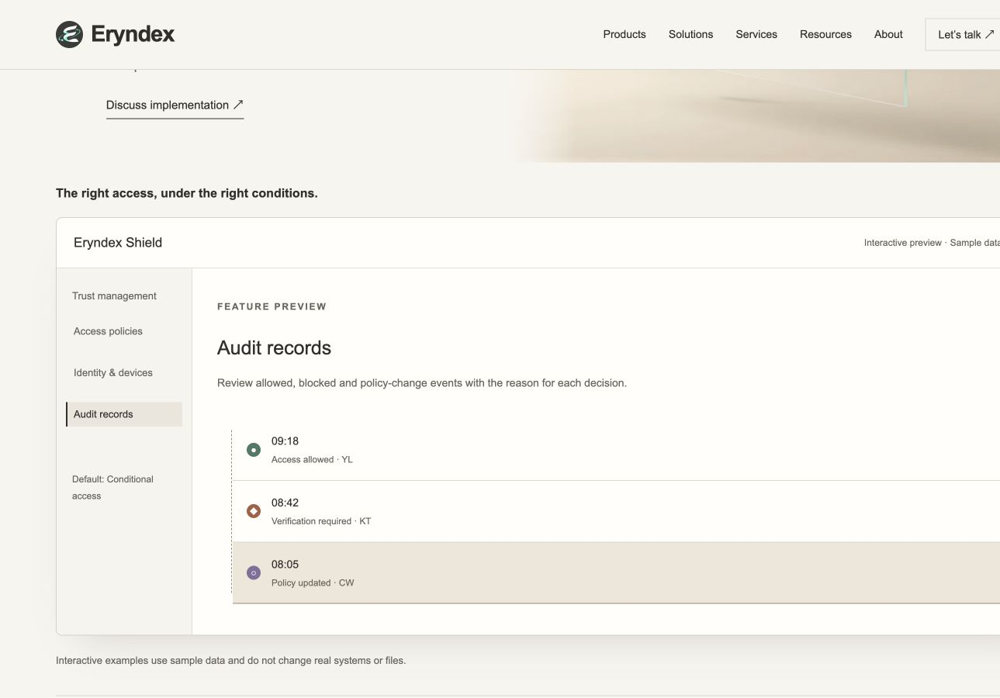
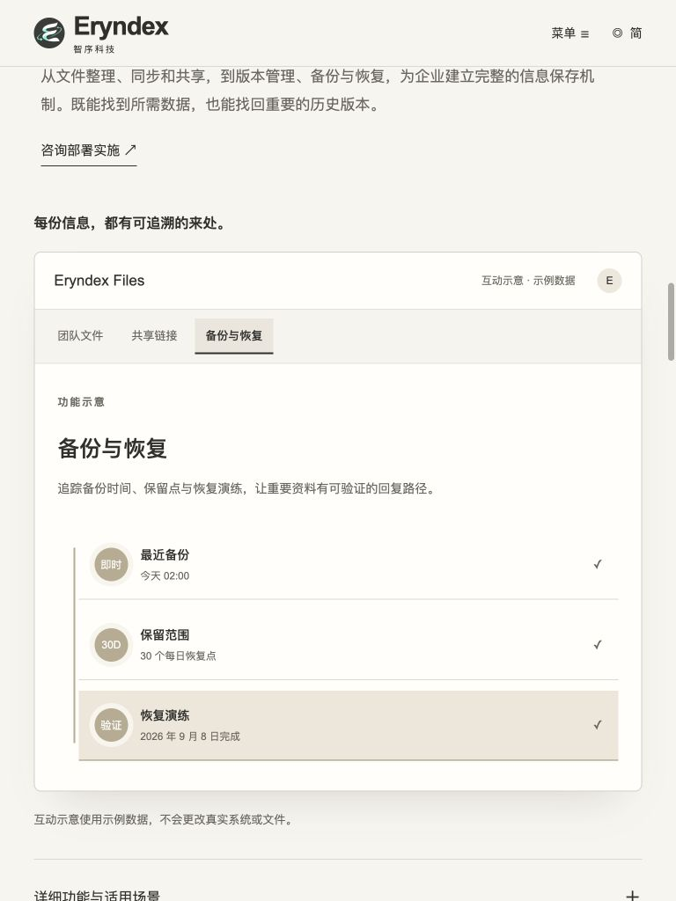
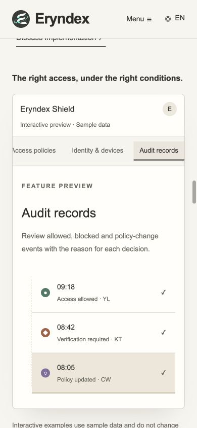

# Eryndex Independent QA Report

## 1. 巡檢目標與正式結論

- 日期：2026-09-12（Asia/Taipei）。Repository：`k129453497-byte/eryndex-multi-solutions`。
- 分支：`feat/editorial-corporate-site`。
- **受驗 HEAD／Developer Response：`7654746f45e6e57d84be2fd4204cf5b1da917338`**。
- **產品修正：`bd83880f50960605617d71005705e995187c306c`**。
- 前輪 QA 報告：`ec30f435680f209d14c9d67fe61beb9854713dc9`。
- **正式結論：PASS；QA-17、QA-18 均為 VERIFIED。Feature panels 修正循環結案。**
- **Final Acceptance：通過此版靜態官網及六個特色互動 Demo 的既定交付範圍。** 此判定綜合前輪完整特色介面驗收與本輪聚焦回歸；不代表正式部署、真實後端或完整無障礙認證。
- 未結客觀缺陷：**CRITICAL 0、HIGH 0、MEDIUM 0、LOW 0**。既有設計／維護待辦與未測範圍仍保留。
- QA 僅更新報告與必要證據；未修改產品、素材、規格或 Developer Response，未部署。

## 2. Source of Truth 與驗收範圍

已 fetch 並核對 feature branch 的受驗 SHA，完整閱讀 `docs/DEVELOPER_QA_RESPONSE.md`，包括 Feature panels — Fix cycle 1，並重新閱讀 `docs/DELIVERY_QA_WORKFLOW.md`。Developer 的 FIXED 不直接等於本報告 VERIFIED；本輪有獨立瀏覽器操作及畫面證據。

相較前輪只改 ProductUI 的三語 marker／aria-pressed 與 backup／audit selected 樣式，規格及其他產品程式未變。依 [PRODUCT_FEATURE_PANELS_20260912.md](PRODUCT_FEATURE_PANELS_20260912.md) 與既有 Master Brief／design／product 文件判定，不從聊天推導新規格。

這是 **Feature panels Fix cycle 1 的獨立回歸**；不累加先前 QA-15 的修正回合。兩項首次修正均通過，不需 Owner 升級決策。

[前輪正式報告](https://github.com/k129453497-byte/eryndex-multi-solutions/blob/ec30f435680f209d14c9d67fe61beb9854713dc9/docs/INDEPENDENT_QA_REPORT.md)保留六種視覺差異、54 組互動、連續鍵盤、返回主功能及原始 QA-17／18 問題證據。本輪對受影響部分回歸，不冒稱全站所有測試重新執行。更早版本的限定驗收紀錄亦保留於 Git history。

環境：macOS Codex Browser／Chromium，Node.js 24.19.0、pnpm 11.19.0。重新建置 production subpath，使用本機 `http://127.0.0.1:4379/eryndex-multi-solutions/`。[三語 HTTP 身分驗證](qa-evidence/7654746/http-build.json)確認回應與受驗 dist 逐位元一致。本輪未以正式站是否已部署作為 PASS 依據。

## 3. QA-17 — 四組 marker 在地化

- **原始 Severity：LOW；Regression Status：VERIFIED。** Area：Feature panels／i18n。Viewport：1440×900、768×1024、390×844。Language：繁中、簡中、英文，九組交叉實測。
- **原問題：**client script 寫死繁中，英文與簡中仍出現「審核、內部、驗證」等字樣。
- **Expected：**實際展開後的功能標籤與頁面語言一致，保留六種介面特色。
- **Actual：**九組皆讀取到以下正確 marker；英文不再混用繁中，簡中不再使用原繁體字。身分／稽核的中性縮寫與符號保留。

| 功能 | 繁中 | 英文 | 簡中 |
|---|---|---|---|
| 團隊知識 | 語／交／規 | Voice／Handoff／Rules | 语言／交接／规范 |
| 工作流程 | 提交／審核／發布 | Submit／Review／Publish | 提交／审核／发布 |
| 分享連結 | 外部／內部／期限 | External／Internal／Expiry | 外部／内部／期限 |
| 備份與還原 | 即時／30D／驗證 | Live／30D／Verified | 即时／30D／验证 |

- **Evidence：**第 5 節九組 JSON 的 `initial.markers`；[英文知識](qa-evidence/7654746/en-390-knowledge.png)、[英文流程](qa-evidence/7654746/en-1440-workflow.png)、[英文分享](qa-evidence/7654746/en-390-sharing.png)、[簡中備份](qa-evidence/7654746/zh-cn-768-backup-blurred.png)。
- **Recommended Fix：**本輪修正滿足要求，無需再修正。本判定針對新增 marker，不擴大成全篇文案逐句校對。

## 4. QA-18 — 選取語意與焦點移開後的視覺狀態

- **原始 Severity：LOW；Regression Status：VERIFIED。** Area：Feature selection／accessibility。Viewport／Language：九組完整交叉測試。
- **原問題：**六組只有 selected class；backup／audit 的選取背景被覆寫，焦點移開後只有微小位移。
- **Expected：**初始及後續選取與 aria-pressed 一致；backup／audit 在沒有 hover／focus 時仍清楚保留選取提示。
- **Actual：**六個介面初始按鈕均有 aria-pressed。工作流程為 `true/false/false`，其餘為 `false/false/false`。每組依次以滑鼠、Enter、Space 選三項，selected 與 aria-pressed 始終同步，且選取後只有一項為 true；焦點保留於操作按鈕。
- **移開焦點驗證：**每一語言／尺寸的 backup 與 audit 選第三項後，點介面標題移開焦點，等待 180ms CSS transition 結束後取證（300ms）。共 **18 組**確認選取背景為 `rgb(238, 231, 217)`、底線 `rgb(155, 137, 104)`，其他項仍透明。焦點不在項目、transform 不再依靠 2px 位移，視覺提示持續存在。
- **Evidence：**九組 JSON 的 `initial`、`selections`、`blurred`；[英文手機備份](qa-evidence/7654746/en-390-backup-blurred.png)、[英文手機稽核](qa-evidence/7654746/en-390-audit-blurred.png)、[繁中手機稽核](qa-evidence/7654746/zh-tw-390-audit-blurred.png)。
- **風險與限制：**確認的是瀏覽器 DOM 的按下狀態、鍵盤操作與實際畫面，未執行螢幕閱讀器或完整 WCAG audit。沒有真實分享、備份或存取系統變更。
- **Recommended Fix：**本輪修正滿足要求，無需進一步修正。

## 5. 三語／三尺寸矩陣與檢查

每組六個入口皆實際開啟，三個項目各選一次，再返回主要入口；共 **54 組介面、162 次選取**。矩陣的 PASS 包含初始與更新後的 aria-pressed、唯一選取、操作焦點保留及返回面板關閉。

| 語言／尺寸 | 四組 marker | 六組選取語意／焦點／返回 | backup／audit 移開焦點 | 整頁 overflow／Console error | 證據 |
|---|---|---|---|---|---|
| 繁中 1440×900 | PASS | PASS | PASS | 無／0 | [JSON](qa-evidence/7654746/zh-tw-1440-regression.json) |
| 簡中 1440×900 | PASS | PASS | PASS | 無／0 | [JSON](qa-evidence/7654746/zh-cn-1440-regression.json) |
| 英文 1440×900 | PASS | PASS | PASS | 無／0 | [JSON](qa-evidence/7654746/en-1440-regression.json) |
| 繁中 768×1024 | PASS | PASS | PASS | 無／0 | [JSON](qa-evidence/7654746/zh-tw-768-regression.json) |
| 簡中 768×1024 | PASS | PASS | PASS | 無／0 | [JSON](qa-evidence/7654746/zh-cn-768-regression.json) |
| 英文 768×1024 | PASS | PASS | PASS | 無／0 | [JSON](qa-evidence/7654746/en-768-regression.json) |
| 繁中 390×844 | PASS | PASS | PASS | 無／0 | [JSON](qa-evidence/7654746/zh-tw-390-regression.json) |
| 簡中 390×844 | PASS | PASS | PASS | 無／0 | [JSON](qa-evidence/7654746/zh-cn-390-regression.json) |
| 英文 390×844 | PASS | PASS | PASS | 無／0 | [JSON](qa-evidence/7654746/en-390-regression.json) |

- [Astro check](qa-evidence/7654746/check.txt)：28 files，0 errors／warnings／hints。
- [Production build](qa-evidence/7654746/build.txt)：59 pages，PASS。
- [Static QA](qa-evidence/7654746/static-qa.txt)：294 links、258 asset references、6 Master、3 locales、54 redirects、contact draft，PASS。
- [Localization regression](qa-evidence/7654746/localization.txt)：PASS；QA-17 另外由展開後的 Browser 文字驗證，不僅採信靜態檢查。

### 實際修正畫面

以下均在焦點移開後擷取，不把焦點框當成選取背景。截圖為局部 viewport；桌面 App 畫布可能裁去右緣，整頁 overflow 以實測 DOM 寬度判斷。

| 英文桌面 | 簡中平板 | 英文手機 |
|---|---|---|
|  |  |  |

## 6. PASS Gate、評分與手動確認

依 DELIVERY_QA_WORKFLOW，前輪六種特色視覺、三語／三尺寸互動、連續鍵盤與返回主功能已有證據，本輪兩項缺陷已全部修正，且沒有發現新增客觀阻擋。因此此版既定官網／Demo 交付範圍 PASS／Final Acceptance；不因尚未執行未約定的完整全站重測而延長修正循環。

滿分 10，保留前輪數值，不因缺陷關閉自動加分。分數為有證據的 reviewer 判斷，非量測工具產生的事實；未變部分沿用前輪範圍。

| 面向 | 最終分數 | 判斷與限制 |
|---|---:|---|
| Executive Visual | 8/10 | 官方構圖與既有視覺語言維持，素材未替換。 |
| One-page Narrative | 7/10 | 敘事未改；長頁取捨仍為既有 QA-04 待辦。 |
| Product Differentiation | 8/10 | 六種特色介面成立，新增標籤及選取回饋已修正。 |
| Services Positioning | 9/10 | 專業服務定位未改，不是第四軟體。 |
| Solutions Clarity | 8/10 | 方案內容未改，沿用前輪檢查。 |
| Desktop | 8/10 | 本輪三語選取、焦點及文字均通過。 |
| Tablet | 8/10 | 三語功能正常，選取提示持續可見。 |
| Mobile | 7/10 | 單欄與操作正常、無整頁溢出；原長頁閱讀成本仍存在。 |

**是否需 Owner 手動確認：**本輪無需修正決策；未涉及品牌、產品或素材爭議。驗收不等於部署授權，QA 不部署。

## 7. 可直接複製的驗證方式

1. 展開六個次要入口，核對四組 marker 與目前語言。
2. 初始確認 workflow 第一項 aria-pressed=true，其餘項目依實際選取為 false。
3. 依次點第一項、Enter 選第二項、Space 選第三項，確認 selected 與 aria-pressed 同步，焦點仍在按鈕。
4. backup／audit 選取後點標題，等待畫面穩定；背景與底線仍應標示所選項目。
5. 返回主要入口，在三種尺寸確認面板關閉與整頁寬度正常。

```sh
# 在受驗提交的獨立 checkout 執行；錯誤即停止，不部署。
set -eu
test "$(git rev-parse HEAD)" = "7654746f45e6e57d84be2fd4204cf5b1da917338"
pnpm install --frozen-lockfile
pnpm check
SITE_URL=https://k129453497-byte.github.io BASE_PATH=/eryndex-multi-solutions pnpm build
BASE_PATH=/eryndex-multi-solutions pnpm qa
node scripts/qa-localization.mjs
```

預覽：`BASE_PATH=/eryndex-multi-solutions pnpm preview --port 4379`。QA 報告提交雖不改產品，SHA 仍不同；使用受驗 checkout 執行 guard。

## 8. 未測範圍與既有待辦

- 本輪未重跑完整 Contact／SEO／效能／全部錨點、全部長文校對、全部狀態排列組合。前輪與更早數據不冒充本輪量測。
- Safari／Firefox／實體 iOS／Android、螢幕閱讀器、完整 WCAG／對比／200% zoom：NOT TESTED。
- 正式站部署後 HTTP／Browser 驗證、真實分享／備份／身分／稽核後端、郵件寄送與 field Web Vitals：NOT TESTED。
- QA-04 長頁精簡、QA-12 歷史樣式隔離、Hero motion 的既有待辦保留；既有靜態 fallback 依 Repository 規格接受，不宣稱影片驗收完成。
- 舊 QA-08／09／14／15／16 的限定 VERIFIED 沿用歷史紀錄。本輪未改相關邏輯、未發現重開證據。
- Final Acceptance 僅適用受驗版本與明列範圍；後續產品變更仍應依影響驗證。

## 9. Rollback 與提交範圍

QA 沒有更動產品或正式環境，無產品 rollback 可執行。只提交本報告與 `docs/qa-evidence/7654746/`。如需更正，以後續提交保留歷史，不刪除檔案、不 force-push；正式部署回復由 Owner／Developer 依流程處理。
