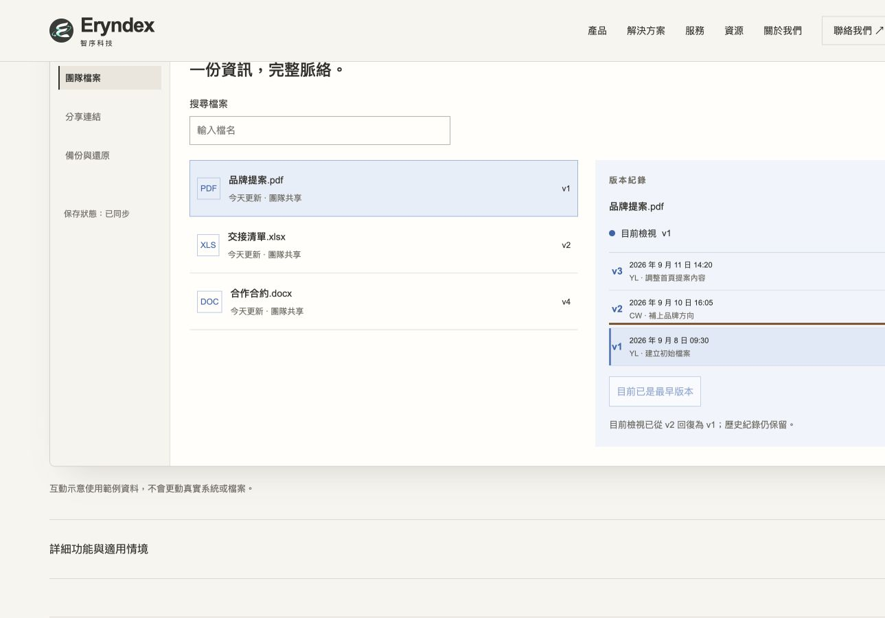
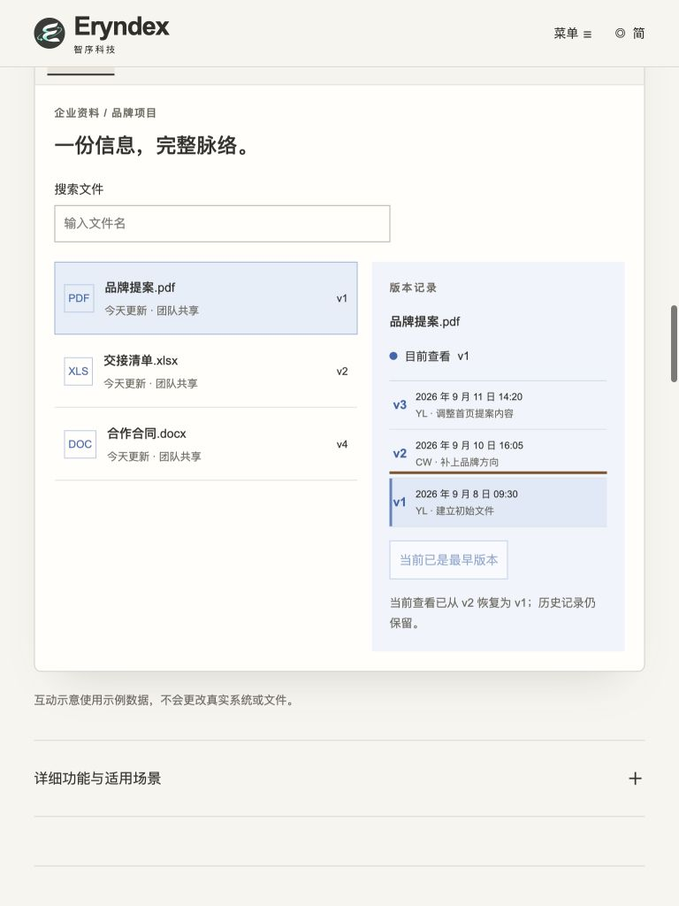
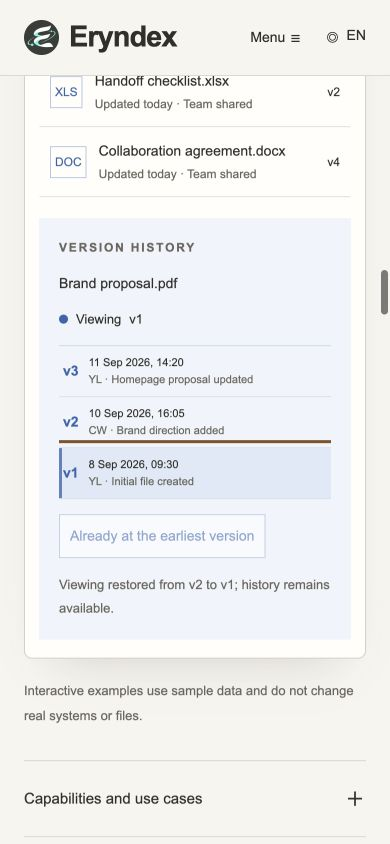

# Eryndex Independent QA Report

## 1. 巡檢目標與正式結論

- 日期：2026-09-12（Asia/Taipei）。Repository：`k129453497-byte/eryndex-multi-solutions`。
- 分支：`feat/editorial-corporate-site`。
- **受驗 HEAD／Developer Response：`a657422ee4d05d22898fbdd6ed8377525024efe3`**。
- **Cycle 2 產品修正：`73fa89eb4dd5e46b576e2d36542900e2c7bce593`**。
- 前輪 QA 報告：`911a4f12843f698acb5fc47fcdbd1bfe9afebb94`。
- **獨立 QA 結論：PASS。QA-15：VERIFIED。五項客觀缺陷均已關閉。**
- **Final Acceptance：通過目前 Repository 定義的一頁式靜態官網／互動 Demo 交付範圍。** 此判定綜合基準 QA、Cycle 1 回歸與本輪最後修正驗證；不是只因 build success，也不是正式部署、真實產品後端或完整無障礙認證。
- 未結客觀缺陷：**CRITICAL 0、HIGH 0、MEDIUM 0、LOW 0**。QA-04 設計取捨、QA-12 維護待辦與已接受的靜態 Hero fallback 仍明列，不宣稱它們已完成。
- QA 只更新本報告與必要證據，未修改網站、素材、Developer Response，未合併到其他分支、部署或寄送郵件。

## 2. Source of Truth、cycle 與測試範圍

完整閱讀 [Developer Response](DEVELOPER_QA_RESPONSE.md)，包含 Cycle 1 與 Cycle 2。相較前輪受驗版，產品只有 `ProductUI.astro` 的一處變更：回復至 v1 時傳入 focusVersion；v3→v2 不強制移動焦點。規格與其他產品程式未變。本輪是 **Developer Cycle 2 修正／獨立複驗**，QA-15 於第二次修正通過，不需升級 Owner。

Repository 是唯一 Source of Truth。沿用已閱讀的 README、Master Brief、design／product 文件、DELIVERY_QA_WORKFLOW、PRODUCT_DEMO_INTERACTION_20260911、FIX_PASS 與 LOCALIZATION_FOLLOWUP。Files 藍色例外、Services 為專業服務而非第四軟體、一頁式形式及靜態 Hero fallback 維持已提交規格。

- [基準正式報告](https://github.com/k129453497-byte/eryndex-multi-solutions/blob/5eed96d92500f4ec73915922079a408b3ed62df1/docs/INDEPENDENT_QA_REPORT.md)：產品 `4761217` 的整體檢查、三語九組矩陣、導航／鍵盤／效能抽測、評分及限制。
- [Cycle 1 正式報告](https://github.com/k129453497-byte/eryndex-multi-solutions/blob/911a4f12843f698acb5fc47fcdbd1bfe9afebb94/docs/INDEPENDENT_QA_REPORT.md)：產品 `818b3e0`／回應 `8687c9d`，九組三產品 smoke、三語表單回歸，四項 VERIFIED，QA-15 剩餘最早版本失焦。
- 本輪只重新測 QA-15 與三尺寸 Files 受影響流程，不將歷史測試假稱為本輪重跑。歷史報告與證據完整保留。

環境：macOS Codex Browser／Chromium，Node.js 24.19.0、pnpm 11.19.0。重新產生 production subpath build，完成後重新載入 `http://127.0.0.1:4379/eryndex-multi-solutions/`；未測其他既存服務或正式部署。[三語 HTTP 身分證據](qa-evidence/a657422/http-build.json)確認回應與本輪 dist 逐位元相同。

## 3. QA-15 複驗結果、風險與影響範圍

- **Issue：QA-15；原始 Severity：LOW；最新 Status：VERIFIED。** 已關閉，不計入未結缺陷。
- **Area：**Files keyboard／version restore。
- **Viewport／Language：**繁中 1440×900、簡中 768×1024、英文 390×844，三組配對實測；不是本輪九組完整交叉測試。
- **原問題：**v2→v1 後回復按鈕 disabled，穩定後焦點回 BODY。
- **Expected：**回復到最早版本後焦點位於 v1 時間軸按鈕；仍保留完整歷史、最早版本停用及成功訊息；v3→v2 時保留可繼續操作的回復按鈕焦點。
- **Actual：**三組皆從首次 v2 點擊，連續 Tab 到 v1、Tab 到回復、Enter 回到 v1。立即結果及截圖後的下一次獨立工具呼叫均確認 `activeElement.tagName=BUTTON`、`data-history-version=1`。不是僅讀取事件當下的瞬間狀態。
- **反向確認：**重新以 Enter 選 v3，回復至 v2 時焦點仍為回復按鈕，再按 Enter 到 v1，焦點再次到 v1；沒有提前把焦點移離可繼續使用的回復按鈕。
- **影響限制：**本地 Demo 狀態，不是正式檔案復原。沒有資料刪除或後端存取。未執行螢幕閱讀器測試，不據此宣稱完整 WCAG 通過。
- **Recommended Fix：**本輪修正已滿足重現案例及受影響流程，無需進一步修正或 Owner 手動確認。

### 三尺寸 Files smoke

每組另點兩個次要側欄並返回主要入口；依序切換 XLS、DOC、PDF，確認分別保留 2／4／3 筆時間軸，回到 PDF 仍為 v1。

| 語言／尺寸 | v2→v1 穩定焦點 | v3→v2 焦點／再次回復 | 側欄三動作 | XLS／DOC／PDF 狀態保留 | 整頁溢出／Console error | 證據 |
|---|---|---|---|---|---|---|
| 繁中 1440×900 | v1 BUTTON，PASS | PASS | PASS | PASS | 無／0 | [JSON](qa-evidence/a657422/zh-tw-1440-files.json) |
| 簡中 768×1024 | v1 BUTTON，PASS | PASS | PASS | PASS | 無／0 | [JSON](qa-evidence/a657422/zh-cn-768-files.json) |
| 英文 390×844 | v1 BUTTON，PASS | PASS | PASS | PASS | 無／0 | [JSON](qa-evidence/a657422/en-390-files.json) |

### 本輪檢查

- [Astro check](qa-evidence/a657422/check.txt)：28 files，0 errors／warnings／hints。
- [Production build](qa-evidence/a657422/build.txt)：PASS，59 pages。
- [Static QA](qa-evidence/a657422/static-qa.txt)：PASS，294 links、258 asset references、6 Master、3 locales、54 redirects、contact draft。
- Browser viewport 覆寫已在測試後還原。

### 實際畫面

畫面可見 v1 選取與焦點提示。桌面 CSS viewport 為 1440，App 截圖畫布可能裁去右緣；整頁溢出判定使用 JSON 寬度，不把截圖裁切視為網站錯誤。

| 桌面 | 平板 | 手機 |
|---|---|---|
|  |  |  |

## 4. 五項缺陷結案與 PASS Gate

| Issue | 原始 Severity | 最新狀態 | 修正／驗證依據 |
|---|---|---|---|
| QA-14 初始時間軸無反應 | MEDIUM | VERIFIED | Cycle 1 九組首次 v2 成功；本輪三組再次確認。 |
| QA-15 版本切換／最早回復失焦 | LOW | VERIFIED | Cycle 1 修正時間軸；Cycle 2 完成最早回復焦點，見本輪 JSON。 |
| QA-09 簡中恢復誤用「回复」 | LOW | VERIFIED | Cycle 1 三尺寸實際文案通過；本輪簡中亦保留正確「恢复」。 |
| QA-08 無效輸入留下舊草稿 | MEDIUM | VERIFIED | Cycle 1 三語有效／失效／修正後再提交證據；本輪未更改 Contact，不重跑。 |
| QA-16 CSS media 未關閉 | LOW | VERIFIED | Cycle 1 parser／建置／三尺寸通過；本輪未改 CSS，建置再次通過。 |

依 DELIVERY_QA_WORKFLOW，無 Critical／High，既有主要互動及三尺寸／三語已完成，最後客觀缺陷已修正；產品差異化、Services 定位、主要內容、錨點、連結與基本可及性沿用基準及 Cycle 1 有證據的檢查。未改區域不重新進行昂貴全站檢查，也不以新增未約定門檻延長修正循環。因此目前官網交付範圍可以 PASS／Final Acceptance，五項修正循環結案。

## 5. 最終評分、既有待辦與未測範圍

滿分 10，分數是依實際證據作成的 reviewer 判斷，不是量測工具輸出的客觀事實。沿用基準數值，不因缺陷關閉自動加分；更新已失效的扣分說明。

| 面向 | 最終分數 | 判斷依據及限制 |
|---|---:|---|
| Executive Visual | 8/10 | 官方暖白、主視覺、構圖及文字層級成立；未取代 Owner 的品牌方向決策。 |
| One-page Narrative | 7/10 | 產品→方案→服務等一頁流程清楚；QA-04 手機長頁取捨仍是後續設計待辦。 |
| Product Differentiation | 8/10 | 工作流、資訊版本及存取政策各自可辨識，Demo 主要操作已通過。 |
| Services Positioning | 9/10 | Professional Services、導入／訓練／維運邊界清楚，不是第四軟體。 |
| Solutions Clarity | 8/10 | 四種情境與產品搭配清楚；全篇商業文案未逐句驗證。 |
| Desktop | 8/10 | 三產品基準 smoke 與本輪 Files 鍵盤流程通過；非跨瀏覽器全面認證。 |
| Tablet | 8/10 | 功能列、版本與方案抽測可用；本輪 Files 狀態／焦點正常。 |
| Mobile | 7/10 | 互動可用且無整頁溢出，Files 焦點修正完成；長頁及局部橫向選單仍增加閱讀成本。 |

- QA-04 長頁精簡：既有設計偏好／Owner 待辦，未有客觀頁高上限，不是未修客觀缺陷，也不宣稱 Owner 已同意所有取捨。
- QA-12 歷史樣式隔離：KNOWN PENDING ITEM，未證實造成 runtime 故障；本輪未將維護重構列為阻擋。
- Hero production motion：KNOWN PENDING ITEM；依已提交規格接受靜態 fallback，此次未驗收影片播放。
- Safari／Firefox／實體 iOS／Android、完整 WCAG／螢幕閱讀器／200% zoom：NOT TESTED。
- 全語言長文逐句校對、全部錨點及所有展開排列組合：NOT TESTED；僅沿用已列出的抽測。
- 正式部署、第三方 OG cache、真實郵件應用／寄送、真實產品後端／備份還原、field Web Vitals：NOT TESTED。
- 效能、Reduced Motion、導航的基準抽測未在本輪重新量測；不把舊數據當作新提交量測。
- Final Acceptance 僅適用此受驗版本及上述官網交付範圍。後續產品變更需按影響重新驗證；本結論不授權部署或取代部署後驗證。

## 6. 可直接複製的驗證步驟與 Rollback

1. 載入該語言頁，直接點 Files 時間軸 v2。
2. Tab 到 v1，再 Tab 到回復按鈕，Enter。
3. 畫面穩定後確認焦點在 v1、回復停用、歷史三筆及成功訊息保留。
4. 用 Enter 選 v3，再回復至 v2，確認焦點仍在回復按鈕；再次 Enter 到 v1。
5. 切換 Files 側欄與 XLS／DOC／PDF，確認內容及各檔案版本狀態。

```sh
# 在受驗提交的獨立 checkout 執行；錯誤即停止，不會部署。
set -eu
test "$(git rev-parse HEAD)" = "a657422ee4d05d22898fbdd6ed8377525024efe3"
pnpm install --frozen-lockfile
pnpm check
SITE_URL=https://k129453497-byte.github.io BASE_PATH=/eryndex-multi-solutions pnpm build
BASE_PATH=/eryndex-multi-solutions pnpm qa
```

預覽：`BASE_PATH=/eryndex-multi-solutions pnpm preview --port 4379`。若 checkout 是 QA 報告提交而非受驗提交，SHA guard 不會相等；使用受驗 checkout，不修改產品來繞過 guard。

**是否需要手動確認：**本輪無需 Owner 修正決策。QA 未變更產品，無產品 rollback 可執行；若需更正報告，以後續提交保留歷史，不刪檔、不 force-push。部署及正式產品回復另由 Owner／Developer 依流程處理。
