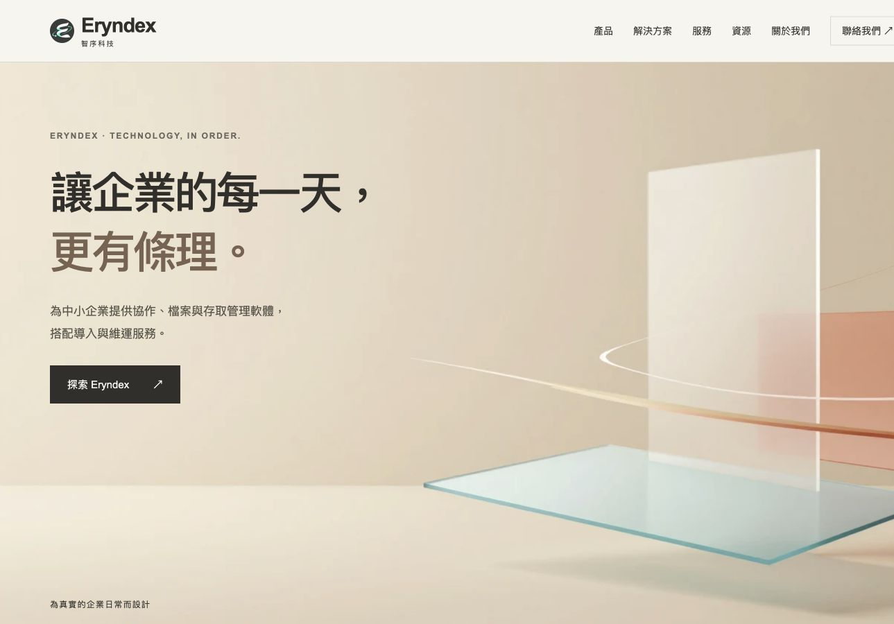
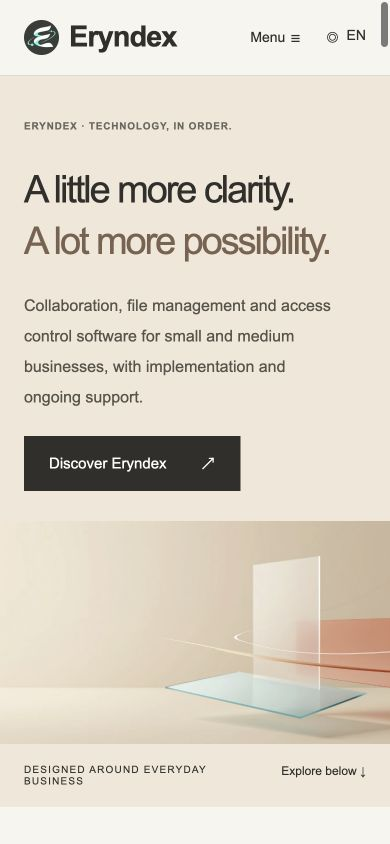

# Eryndex Independent QA Report

## 1. 巡檢目標與正式結論

- 日期：2026-09-12（Asia/Taipei）。Repository：`k129453497-byte/eryndex-multi-solutions`。
- 分支：`feat/editorial-corporate-site`。
- **受驗 HEAD／Developer Response：`8687c9df53249477f37a169c1cf0065cc020de2b`**。
- **產品修正：`818b3e061b5e5937a5830eaa6b3c5bb2684f191f`**。
- 基準 QA 報告：`5eed96d92500f4ec73915922079a408b3ed62df1`；其產品受驗版為 `476121718885b39f9c4ebd10b08beb0a9bd22d13`。
- **聚焦 Regression 結論：PASS WITH CONDITIONS；不授予無條件 PASS／Final Acceptance。**
- 五項中 **4 項 VERIFIED，1 項 PARTIALLY FIXED**。未結客觀缺陷為 **CRITICAL 0、HIGH 0、MEDIUM 0、LOW 1（QA-15）**，不把既有設計／維護待辦算入此缺陷數。
- 九組語言／尺寸的首次版本切換、三產品側欄、同一任務流轉、v3→v2→v1 與最早版本停用均可執行；剩餘問題是最後一次回復造成鍵盤焦點消失。
- 本輪只更新本報告及 `docs/qa-evidence/8687c9d/`，未改產品、素材、Developer Response，未合併到其他分支、部署或寄信。

### Source of Truth 與 cycle

完整閱讀 GitHub 提交中的 [Developer Response](DEVELOPER_QA_RESPONSE.md)，並核對五項實作差異。該文件的 FIXED 是 Developer 回應；本報告的 VERIFIED／PARTIALLY FIXED 才是獨立複驗結果。兩個 Medium 已關閉，不能據此把未修完的 Low 一併標成 VERIFIED。

本輪是基準報告後的 **Developer Cycle 1 修正／獨立複驗**，也是第二次有正式報告證據的 QA 執行；不是第三輪。QA-15 尚未達到三次修正失敗的 Owner 升級門檻。

規格沿用 Repository 的 README、Master Brief、design／product 文件、DELIVERY_QA_WORKFLOW、PRODUCT_DEMO_INTERACTION_20260911、FIX_PASS 與 LOCALIZATION_FOLLOWUP；相較基準 QA，本輪只新增 Developer Response 並修改四個程式／檢查檔，未改產品規格或素材。Files 藍色例外、Services 為專業服務而非第四軟體、一頁式網站及靜態 Hero fallback 等既有規格不重新解釋。

[上一版完整正式報告](https://github.com/k129453497-byte/eryndex-multi-solutions/blob/5eed96d92500f4ec73915922079a408b3ed62df1/docs/INDEPENDENT_QA_REPORT.md)及 [4761217 原始證據](qa-evidence/4761217/)保留歷史原因、重現步驟與當時判定。本文件以下內容為最新狀態；不將舊失敗或舊效能數字當成目前實測。

## 2. 測試環境、範圍與證據

在獨立 checkout 重新建置 production subpath，使用 macOS Codex Browser／Chromium、本機 `http://127.0.0.1:4379/eryndex-multi-solutions/`。Node.js 24.19.0／pnpm 11.19.0。測試資料僅內建 Demo 與 `QA Example / Example QA / qa@example.com`。

[HTTP 建置身分驗證](qa-evidence/8687c9d/http-build.json)：58 個可直接請求的 HTML 回應均與本輪 dist 逐位元相同，排除誤測其他預覽服務；404 不列入這 58 個請求。建置本身共 59 HTML。

### 九組互動矩陣

每組新載入後，不先選檔或回復，直接點時間軸 v2；再以 Enter 選 v3，兩次 Enter 回復至 v1。依序點各產品兩個次要側欄及返回主要入口，共 9 次側欄動作。最後操作同一張任務「開始→完成→重新開啟」，欄位數依序為 `1/2/1 → 1/1/2 → 1/2/1`。JSON 包含每步畫面狀態、焦點與文字，不是僅驗證按鈕存在。

| 語言 | Viewport | 首次 v2／時間軸 Enter | 側欄 9 動作 | 同一任務 3 步 | 回復／歷史保留／最早停用 | 整頁溢出／Console error | 證據 |
|---|---|---|---|---|---|---|---|
| 繁中 | 1440×900 | PASS | PASS | PASS | PASS，焦點見 QA-15 | 無／0 | [JSON](qa-evidence/8687c9d/zh-tw-1440-regression.json) |
| 簡中 | 1440×900 | PASS | PASS | PASS | PASS，焦點見 QA-15 | 無／0 | [JSON](qa-evidence/8687c9d/zh-cn-1440-regression.json) |
| 英文 | 1440×900 | PASS | PASS | PASS | PASS，焦點見 QA-15 | 無／0 | [JSON](qa-evidence/8687c9d/en-1440-regression.json) |
| 繁中 | 768×1024 | PASS | PASS | PASS | PASS，焦點見 QA-15 | 無／0 | [JSON](qa-evidence/8687c9d/zh-tw-768-regression.json) |
| 簡中 | 768×1024 | PASS | PASS | PASS | PASS，焦點見 QA-15 | 無／0 | [JSON](qa-evidence/8687c9d/zh-cn-768-regression.json) |
| 英文 | 768×1024 | PASS | PASS | PASS | PASS，焦點見 QA-15 | 無／0 | [JSON](qa-evidence/8687c9d/en-768-regression.json) |
| 繁中 | 390×844 | PASS | PASS | PASS | PASS，焦點見 QA-15 | 無／0 | [JSON](qa-evidence/8687c9d/zh-tw-390-regression.json) |
| 簡中 | 390×844 | PASS | PASS | PASS | PASS，焦點見 QA-15 | 無／0 | [JSON](qa-evidence/8687c9d/zh-cn-390-regression.json) |
| 英文 | 390×844 | PASS | PASS | PASS | PASS，焦點見 QA-15 | 無／0 | [JSON](qa-evidence/8687c9d/en-390-regression.json) |

版本回復是本地展示狀態，並非真實備份還原。不同檔案切換的完整流程已有基準證據，本輪矩陣聚焦預設 PDF 的時間軸與回復，不宣稱重新測完全部檔案排列組合。

### 建置與靜態檢查

- [Astro check](qa-evidence/8687c9d/check.txt)：28 files，0 errors／warnings／hints。
- [Production build](qa-evidence/8687c9d/build.txt)：PASS，59 pages。
- [Static QA](qa-evidence/8687c9d/static-qa.txt)：PASS，294 links、258 asset references、6 Master、3 locales、54 redirects、contact draft。
- [Localization](qa-evidence/8687c9d/localization.txt)：PASS；另有簡中瀏覽器實際恢復文案，未僅採信新增字串測試。
- [CSS parser／Prettier](qa-evidence/8687c9d/css-parse.txt)：PASS，不再出現 Unclosed block。

## 3. 五項修正的獨立判定

共同修正 commit 為 `818b3e061b5e5937a5830eaa6b3c5bb2684f191f`；以下 Severity 保留原始問題等級，已 VERIFIED 者不計入未結缺陷。

| ID | Severity | Regression Status | Area／Viewport／Language | Expected 與本次 Actual／Evidence |
|---|---|---|---|---|
| QA-14 | MEDIUM | **VERIFIED** | Files／三尺寸／三語 | 預期初始時間軸立即可用。九組首次直接點 v2 均切為 v2，active row 一致；後續 Enter 選 v3 也正常。見矩陣 JSON 的前兩步。容器委派事件修正成立。 |
| QA-15 | LOW | **PARTIALLY FIXED** | Files keyboard／三尺寸矩陣；英文手機連續 Tab 詳驗／三語共用 | 時間軸重建後焦點已留在所選版本按鈕，九組均成立；但回復至 v1 導致回復按鈕 disabled，稍後 activeElement 仍變 BODY。詳細重現與限制如下。 |
| QA-09 | LOW | **VERIFIED** | Files i18n／三尺寸／簡中 | 按鈕實際為「恢复上一版本」，完成訊息為「当前查看已从 v3 恢复为 v2；历史记录仍保留。」；最早版本為「当前已是最早版本」。矩陣與[平板畫面](qa-evidence/8687c9d/zh-cn-768-restored.png)確認此動作不再使用「回复」。 |
| QA-08 | MEDIUM | **VERIFIED** | Contact／繁中桌面、簡中平板、英文手機 | 正常草稿成功；改動姓名、錯誤 email、取消 consent、trim 後過短需求時，提交前就隱藏結果、清空草稿／status 並重設 mailto；無效提交後仍保持失效。逐項修正後皆能重新產生草稿。見下方三語 JSON。 |
| QA-16 | LOW | **VERIFIED** | 共用 CSS／source 及三尺寸 smoke／三語 | 原始 CSS 可解析，Prettier 通過；Astro check／build／static QA 及三尺寸實際互動沒有發現新增版型阻擋。補齊 media 邊界的修正成立。 |

QA-08 證據：[繁中 1440](qa-evidence/8687c9d/zh-tw-1440-contact.json)、[簡中 768](qa-evidence/8687c9d/zh-cn-768-contact.json)、[英文 390](qa-evidence/8687c9d/en-390-contact.json)。每語包含 1 次初始有效草稿、4 組變更／拒絕／修正後提交，共 13 個狀態。未開啟郵件應用或寄送資料。

### QA-15 剩餘問題：最早版本回復後失焦

- **Description／Actual：**v2 時以 Tab 到回復按鈕並 Enter 回到 v1，版本與成功訊息正確，按鈕合理停用；但穩定後 `document.activeElement` 是 BODY，沒有明確的目前操作焦點。
- **Expected：**最後一次回復完成後，焦點轉到 v1 時間軸按鈕或另一個明確結果位置，讓鍵盤操作位置可追蹤。
- **影響範圍：**Files 回復到最早版本的鍵盤邊界。桌面三語及英文手機矩陣已有 BODY 證據；英文手機另用連續 Tab／Enter 重現。矩陣其他組即時讀值曾暫留 disabled 按鈕，不將瞬間讀值宣稱為穩定焦點 PASS。
- **Evidence：**[連續鍵盤操作與穩定後結果](qa-evidence/8687c9d/qa15-terminal-focus.json)。`settled after screenshot` 明確為 BODY；下一次 Tab 到下方「Capabilities and use cases」SUMMARY。
- **反證與風險限制：**原本的時間軸失焦已修正；回復功能未失敗，三筆歷史仍在，有 role=status 成功訊息，下一次 Tab 可繼續，沒有鍵盤陷阱或必須從頁首重走的證據。因此維持 **LOW**，不升級為全站 Accessibility 阻擋，也不主張已完成螢幕閱讀器測試。
- **原因定位：**`src/components/ProductUI.astro` 的回復 handler 仍呼叫 `showHistory(selected)`；只有時間軸選取傳入 focusVersion。最早版本會停用原本聚焦的回復按鈕，沒有補上焦點目的地。
- **Recommended Fix：**僅在回到最早版本、現有回復控制項將停用時，把焦點移到目前 v1 按鈕；保留成功 status 與 disabled 邊界。亦可採其他可驗證的明確結果焦點方案。

## 4. 可直接複製的驗證方式與後續

QA-15 操作步驟：

1. 開啟英文頁，viewport 設 390×844（桌面亦可）。
2. 點時間軸 v2，確認目前顯示 v2。
3. 在 v2 按鈕按 Tab 到 v1，再按 Tab 到 Restore previous version。
4. 按 Enter，確認回到 v1、歷史保留及回復按鈕停用。
5. 等畫面穩定後確認焦點是否落在明確結果位置；目前會回 BODY。再按 Tab 可到下方詳細功能 SUMMARY。

建置驗證（獨立受驗 checkout；不部署）：

```sh
# 任一步失敗即停止；版本不同時不繼續測錯誤版本。
set -eu
test "$(git rev-parse HEAD)" = "8687c9df53249477f37a169c1cf0065cc020de2b"
pnpm install --frozen-lockfile
pnpm check
SITE_URL=https://k129453497-byte.github.io BASE_PATH=/eryndex-multi-solutions pnpm build
BASE_PATH=/eryndex-multi-solutions pnpm qa
node scripts/qa-localization.mjs
pnpm exec prettier src/styles/pages.css --check
```

預覽：`BASE_PATH=/eryndex-multi-solutions pnpm preview --port 4379`。QA 報告提交的網站 tree 雖與受驗版相同，SHA guard 仍以獨立受驗 checkout 為準。

下一輪只需 Developer 回應並修正 QA-15 剩餘邊界，再複驗時間軸鍵盤切換、兩次回復、最早停用後焦點與三尺寸 smoke。**不需要 Owner 手動確認一般焦點修正；本 QA 不修改網站。** 沒有重大品牌／產品爭議或三輪失敗，不升級 Owner。

## 5. 既有項目與評分

未改動部分沿用基準證據，明確不宣稱本輪全部重測：QA-01／02／03／05／06／07／10／11／13 先前的限定 VERIFIED 保留；QA-04 長頁精簡仍為設計偏好及 Owner 待辦，QA-12 歷史樣式隔離仍為維護待辦。六 Master 本輪重新通過 hash 檢查。這些待辦沒有新增客觀阻擋，也沒有被本輪 QA 擅自標成 Owner 已接受。

以下保留基準的 reviewer 評分，**不是本輪全站重新評分或 Final Acceptance 分數**。本輪未重審全站敘事／方案／Art Direction，不因四項修正自動調高分數；已修正缺陷的舊扣分理由不再視為目前缺陷。

| 面向 | 暫定分數 | 本輪解讀 |
|---|---:|---|
| Executive Visual | 8/10 | 既有素材及構圖證據沿用，未重做 Art Direction 驗收。 |
| One-page Narrative | 7/10 | QA-04 長頁取捨仍待後續確認。 |
| Product Differentiation | 8/10 | 三套操作差異成立，首次時間軸問題已關閉。 |
| Services Positioning | 9/10 | 專業服務定位未變，沿用基準內容檢查。 |
| Solutions Clarity | 8/10 | 本輪未重審全部方案內容。 |
| Desktop | 8/10 | 功能 smoke 通過，QA-15 最早版本焦點仍未結。 |
| Tablet | 8/10 | 三語功能 smoke 通過，簡中恢復文案已關閉。 |
| Mobile | 7/10 | 功能可用且無整頁溢出；長頁待辦及 QA-15 仍保留。 |

### 本輪實際畫面

檔名中的尺寸是 CSS viewport；桌面截圖受 App 可見畫布限制，可能裁去右緣，不據此判斷網站溢出。互動判定以對應 JSON 為證；主視覺圖片只證明畫面，不能代替鍵盤焦點證據。

| 繁中桌面 | 簡中平板回復 | 英文手機 |
|---|---|---|
|  |  |  |

## 6. 驗收界線與 Rollback

- 本輪是指定五項及受影響流程的聚焦 Regression，沒有重新執行昂貴全站測試。上一版網路、Reduced Motion、效能及錨點抽測是歷史證據；本輪未重新量測效能，不沿用 516ms 作新提交數字。
- Safari／Firefox／實體 iOS／Android、完整 WCAG／螢幕閱讀器／200% zoom、全部長文校對、全部錨點／展開組合、第三方 OG、真實郵件應用／寄送、正式部署與後端產品、正式備份還原：**NOT TESTED**。
- Hero production motion 仍為 **KNOWN PENDING ITEM**，依既有文件使用靜態 fallback。
- 本輪 Conditional 結論不等於全站零缺陷或 Final Acceptance。QA-15 的 Low 剩餘邊界是本輪關閉條件；其嚴重度低，不應被描述成主要功能不可用。
- QA 只改報告／證據，無產品 rollback 可執行。若報告需更正，以後續提交保留歷史；不刪除檔案、不 force-push。產品變更／部署回復由 Developer／Owner 依流程處理。
