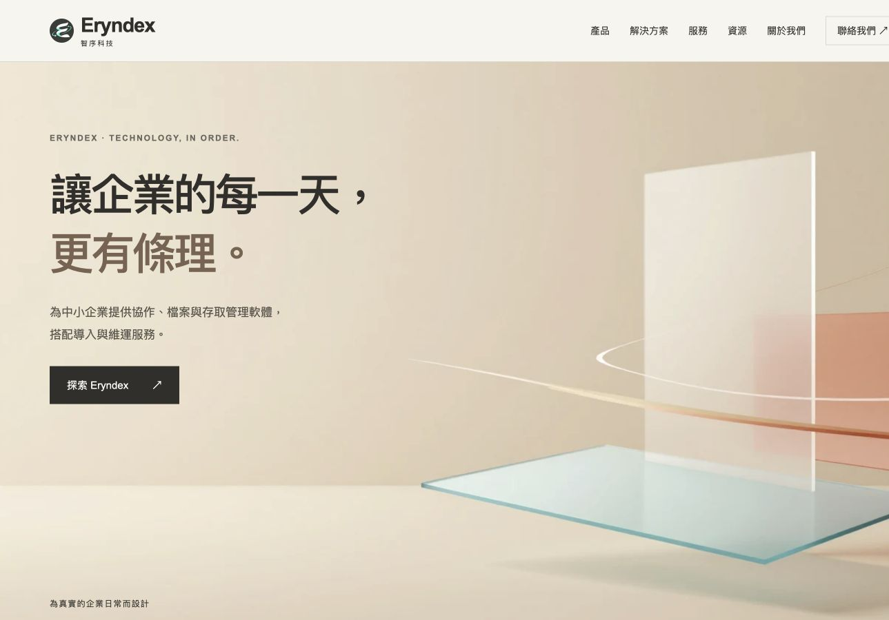
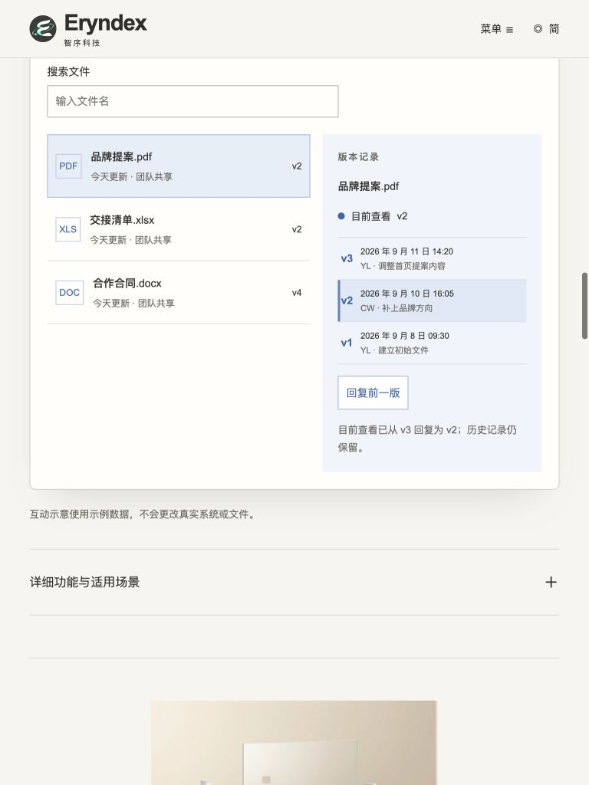
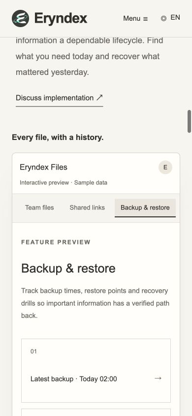

# Eryndex Independent QA Report

## 1. 巡檢目標與正式結論

- 報告日期：2026-09-12（Asia/Taipei）。
- Repository：`k129453497-byte/eryndex-multi-solutions`。
- 分支：`feat/editorial-corporate-site`。
- **受驗 commit：`476121718885b39f9c4ebd10b08beb0a9bd22d13`**。
- **聚焦 Regression 結論：PASS WITH CONDITIONS。尚未授予 Final Acceptance。**
- 主要新增流程可用：三產品全部側欄入口、Space 待處理→進行中→完成／重新開啟、Files 前一版回復與獨立時間軸，皆有實際操作證據。
- 未結客觀缺陷：**CRITICAL 0、HIGH 0、MEDIUM 2、LOW 3**。最終無條件通過前應修正並複驗 QA-08、QA-09、QA-14、QA-15、QA-16；不能將本報告引用為全部功能無缺陷或全站正式驗收通過。
- 本次只提交本報告與必要 QA 證據，未修改網站、素材或 Developer Response，未 merge、部署或寄送聯絡郵件。

### Source of Truth 與交接狀態

2026-09-12 再次 fetch 並確認本機 HEAD 與遠端分支均為上述完整 SHA。受驗網站由該提交的獨立 checkout 建置；[HTTP 證據](qa-evidence/4761217/http-build.json)記錄 58 個可直接請求的 HTML 與此建置逐位元相同。預覽為 `http://127.0.0.1:4379/eryndex-multi-solutions/`，不是既有 4321 服務，也不是未核對版本的正式站。

規格來自 Repository：README、Master Brief、DELIVERY_QA_WORKFLOW、ASSET_GUIDE、DESIGN_SYSTEM、四份 product 文件、PRODUCT_DEMO_INTERACTION_20260911、FIX_PASS_20260911、LOCALIZATION_FOLLOWUP_20260911 及其餘專案交接文件。已檢視官方靜態素材與素材目錄；六個 Master 雜湊重新驗證通過。Motion source 僅核對完整性，不宣稱完成影片循環／播放驗收。

受驗提交中**沒有** `docs/INDEPENDENT_QA_REPORT.md` 或 `docs/DEVELOPER_QA_RESPONSE.md`。FIX_PASS 與 LOCALIZATION_FOLLOWUP 提及先前 QA，但不能據此重建不存在於 Repository 的原始報告、原始 Severity 或完整 cycle 歷史。本文件是首份可追溯的正式基準報告，兼做 Repository 已記錄修正與 Demo 擴充的聚焦回歸。以下沿用文件中的 QA-01～QA-13 編號；Severity 為本次核定。新問題由 QA-14 起編號。此次計為第一個有本報告證據的回歸回合，不把測試重跑或聊天次數當成三輪 Fix／Regression。

## 2. 測試範圍與結果

環境：macOS 上的 Codex Browser／Chromium 152，Node.js 24.19.0、pnpm 11.19.0。測試的是靜態 production subpath build；所有資料均為網站內建示例或 `QA Example / Example QA / qa@example.com`。

### 九組實測矩陣

每組皆重新載入該語言，實際點擊 Space／Files／Shield 的兩個次要入口並返回主要入口，共 9 次側欄動作；另操作任務狀態、首次時間軸按鈕、兩次回復與 XLS／DOC 切換。JSON 保留各步驟的畫面狀態，不是僅檢查按鈕存在。

| 語言 | Viewport | 側欄 9 動作 | 任務流轉 smoke | v3→v2→v1／最早停用 | 首次點 v2 | 水平溢出／Console Error | 證據 |
|---|---|---|---|---|---|---|---|
| 繁中 | 1440×900 | PASS | PASS | PASS | FAIL QA-14 | 無／0 | [JSON](qa-evidence/4761217/zh-tw-1440-regression.json) |
| 簡中 | 1440×900 | PASS | PASS | PASS，文案見 QA-09 | FAIL QA-14 | 無／0 | [JSON](qa-evidence/4761217/zh-cn-1440-regression.json) |
| 英文 | 1440×900 | PASS | PASS | PASS | FAIL QA-14 | 無／0 | [JSON](qa-evidence/4761217/en-1440-regression.json) |
| 繁中 | 768×1024 | PASS | PASS | PASS | FAIL QA-14 | 無／0 | [JSON](qa-evidence/4761217/zh-tw-768-regression.json) |
| 簡中 | 768×1024 | PASS | PASS | PASS，文案見 QA-09 | FAIL QA-14 | 無／0 | [JSON](qa-evidence/4761217/zh-cn-768-regression.json) |
| 英文 | 768×1024 | PASS | PASS | PASS | FAIL QA-14 | 無／0 | [JSON](qa-evidence/4761217/en-768-regression.json) |
| 繁中 | 390×844 | PASS | PASS | PASS | FAIL QA-14 | 無／0 | [JSON](qa-evidence/4761217/zh-tw-390-regression.json) |
| 簡中 | 390×844 | PASS | PASS | PASS，文案見 QA-09 | FAIL QA-14 | 無／0 | [JSON](qa-evidence/4761217/zh-cn-390-regression.json) |
| 英文 | 390×844 | PASS | PASS | PASS | FAIL QA-14 | 無／0 | [JSON](qa-evidence/4761217/en-390-regression.json) |

矩陣的任務 smoke 會操作多張卡；同一張卡完整往返另由[繁中桌面](qa-evidence/4761217/space-desktop.json)與[簡中／英文手機](qa-evidence/4761217/same-task-cycle.json)確認：欄位數量由 `2/1/1` → `1/2/1` → `1/1/2` → `1/2/1`，狀態與可及名稱同步更新。

Files 三份檔案分別有 3、2、4 筆含日期／操作者／摘要的時間軸。PDF 回到 v1 後，切到 XLS v2、DOC v4，再回 PDF 仍是 v1；歷史三筆仍保留。見 [Files 詳細紀錄](qa-evidence/4761217/files-desktop.json)。回復功能是本地展示，不是正式檔案復原測試。

手機 Shield 英文功能列會在**功能列內**水平捲動；可點到第三項並返回，整頁寬度沒有增加。不把這個明確可操作的水平選單判為整頁 overflow。

### 基本 keyboard、建置與其他已完成抽測

- Space 操作後焦點保留在該任務；Files 時間軸例外見 QA-15。
- 手機選單 Escape 關閉並回到 Menu；Shift+Tab 可到 Skip to content，3px 可見焦點，Enter 到 `main`。隱私連結會展開，切英文保留 `#privacy`。見 [keyboard 紀錄](qa-evidence/4761217/navigation-keyboard.json)。該紀錄的政策 top 是載入動畫尚未完成的瞬間值，不當成錨點最終定位的 PASS 證據。
- 簡中平板選單點方案後關閉，方案起點約 110px，展開內容可讀。[方案畫面](qa-evidence/4761217/zh-cn-768-solution.png)。
- [Astro check](qa-evidence/4761217/check.txt)：28 files，0 errors／warnings／hints；[build](qa-evidence/4761217/build.txt)成功。
- [靜態 QA](qa-evidence/4761217/static-qa.txt)：59 HTML、294 連結、258 素材參照、6 Master、3 語言頁、54 相容轉向及草稿邏輯通過。不能取代瀏覽器測試。
- [詞彙檢查](qa-evidence/4761217/localization.txt)通過，但未涵蓋新出現的「回复」錯詞；QA-09 證明靜態 PASS 的覆蓋限制。
- [CSS parse](qa-evidence/4761217/css-parse.txt)失敗，見 QA-16；build success 不抵銷原始 CSS 語法錯誤。
- [網路紀錄](qa-evidence/4761217/network.json)所捕捉的本機載入沒有 request failure；九組測試未擷取到 Console Error。
- 已做一次新版手機效能抽測：390×844、冷快取、150ms latency、1.6Mbps download、CPU 4× slowdown，FCP／觀測到的 LCP 為 **516ms**，短觀測期間 layout-shift events 為空。[原始量測](qa-evidence/4761217/mobile-performance.json)。這不是 Lighthouse 分數、真機數據或正式站使用者 p75；不推論全程 CLS／INP。未沿用其他 commit 成績。
- Reduced motion：`scroll-behavior:auto`、transition 0s、影片元素 0。[證據](qa-evidence/4761217/reduced-motion.json)。

## 3. 客觀缺陷與風險等級

### QA-14 — 初次載入的 Files 時間軸按鈕沒有反應

- **Severity：MEDIUM；Status：OPEN。** Area：Files interaction；Viewport：三種；Language：三語。
- Description／Actual：首次載入後，PDF 已選 v3；直接點時間軸 v2，畫面仍是 v3，active row 不變。九組皆重現。
- Expected：可按的時間軸版本應從首次顯示即可切換，與切換檔案後的相同按鈕一致。
- 重現：重新載入 → 找到 Files → 不先選檔、不先回復 → 直接點日期為 9 月 10 日的 v2。
- Evidence：[首次點擊畫面](qa-evidence/4761217/files-initial-v2-click.png)、[操作前後](qa-evidence/4761217/files-desktop.json)、九組 regression JSON。
- 原因定位：`src/components/ProductUI.astro:245` 產生的初始按鈕沒有綁事件；事件只在 `showHistory()` 建立按鈕時綁定（479–510 行），初始選取檔沒有初始化該流程。
- 反證：先點 PDF 檔案或執行回復，再點 v2 即可切換；因此不是所有版本操作失效，也不是網路錯誤。
- Recommended Fix：統一初次及後續時間軸初始化，或在穩定容器委派事件。驗證首次與後續點擊、三語、keyboard 皆一致。

### QA-15 — 版本切換會移除鍵盤焦點

- **Severity：LOW；Status：OPEN。** Area：Files keyboard；Viewport：1440×900、390×844 實測；Language：繁中、英文實測，共用實作。
- Description／Actual：先選 PDF 初始化時間軸，再以 Enter 啟動 v2；切換成功，但 `activeElement` 變成 BODY，操作焦點框消失，狀態文字為空。
- Expected：切換後焦點留在對應版本按鈕或明確的結果位置，讓鍵盤使用者確認所在位置。
- 重現：點 PDF → Tab／聚焦 v2 → Enter → 觀察焦點 → 再按 Tab。
- Evidence：[keyboard 結果](qa-evidence/4761217/qa15-keyboard.json)、[Files desktop 最後一筆](qa-evidence/4761217/files-desktop.json)。
- 原因定位：`src/components/ProductUI.astro:485,501` 用 `replaceChildren()` 重建正在聚焦的按鈕，沒有恢復焦點。
- 反證與風險限制：下一次 Tab 可回到時間軸 v3，沒有證據顯示鍵盤陷阱或必須從頁首重走；因此列 LOW，不誇大成全站無障礙阻擋。
- Recommended Fix：保留節點或重建後恢復到選取版本，並提供恰當選取狀態／結果回饋；回到 v1 造成回復按鈕 disabled 時也檢查焦點。

### QA-09 — 新 Demo 將資料恢復寫成「回复」

- **Severity：LOW；Status：FAILED REGRESSION。** Area：i18n／Files；Viewport：三種；Language：簡中。
- Description／Actual：按鈕為「回复前一版」，完成訊息為「目前查看已从 v3 回复为 v2；历史记录仍保留。」
- Expected：檔案版本語境使用「恢复」等正確用詞；既有 `LOCALIZATION_FOLLOWUP_20260911.md` 明示資料復原不誤寫成「回复」。
- 重現：簡中 Files → 點「回复前一版」→ 閱讀按鈕與結果訊息。
- Evidence：[量測文字](qa-evidence/4761217/qa09-cn-restore.json)、[768px 實際畫面](qa-evidence/4761217/zh-cn-768-files-restore.png)。其他尺寸亦見 regression JSON 的 history／status 與新元件文案。
- 原因定位：`src/components/ProductUI.astro:257–264` 新增「回復」文案未做語境覆寫。
- Recommended Fix：針對此動作提供簡中整句覆寫，擴充 locale regression；不要全域改寫所有可能代表「回覆」的詞。
- 反證：大部分既有簡中詞彙已正確在地化，三語功能皆可執行。本項僅重開新增恢復文案，不判定整個簡中網站失效。

### QA-08 — 原生驗證拒絕後仍顯示舊草稿

- **Severity：MEDIUM；Status：PARTIALLY FIXED。** Area：Contact state；Viewport／Language：繁中 1440×900、簡中 768×1024、英文 390×844 均重現。
- Description／Actual：有效草稿產生後，用鍵盤清空必填姓名並再次整理草稿；原生驗證要求填寫姓名，但舊草稿及「已準備好」訊息仍顯示，舊郵件入口仍可操作。
- Expected：表單改動或任何驗證失敗後，舊草稿應清除／標為過期，不能讓使用者誤以為它反映目前資料。
- 重現：輸入 QA Example、Example QA、qa@example.com、1234567890 → 勾選本地草稿說明 → 整理草稿 → 姓名全選後 Backspace → 再整理草稿。
- Evidence：[三語實際狀態](qa-evidence/4761217/qa08-contact-regression.json)、[必填空白](qa-evidence/4761217/zh-tw-1440-qa08-invalid.png)、[仍存在的舊草稿](qa-evidence/4761217/zh-tw-1440-qa08-stale-draft.png)。
- 原因定位：`src/components/Contact.astro:147–156` 清理位於 submit listener 內；瀏覽器原生驗證不通過時，不進入該 listener。
- 反證與風險限制：正常 10 字元草稿流程成功；既有 trim 最低長度邏輯存在。本次沒有自動寄信／資料外洩，風險是寄出過期需求內容。這是已完成的附帶複驗，不擴大全站表單測試範圍。
- Recommended Fix：在輸入變更／invalid 流程一致清理或失效化結果；保留必要驗證，複驗空白、錯誤 email、取消勾選及正常再提交。

### QA-16 — CSS media block 未關閉

- **Severity：LOW；Status：OPEN。** Area：Code quality；Viewport／Language：不適用，影響共用 stylesheet。
- Description／Actual：格式解析器回覆 `CssSyntaxError: Unclosed block (885:1)`。
- Expected：原始 CSS 能正常解析；斷點規則的範圍有明確且成對的大括號。
- 重現：執行 `pnpm exec prettier src/styles/pages.css --check`。
- Evidence：[完整解析錯誤](qa-evidence/4761217/css-parse.txt)；`src/styles/pages.css:917–920` 關閉 contact-layout 後缺少外層 1100px media 的結束括號。
- 反證：production build 成功，九組畫面未出現整頁溢出，不能把本項描述成 build failure 或已證實的大面積版型破壞。
- Recommended Fix：補足正確區塊界線，再跑 parser、build 與三尺寸抽測。這是程式品質缺陷，不是純排版風格偏好。

## 4. 既有 QA 修正對照與影響範圍

以下依 Repository 的 FIX_PASS／LOCALIZATION_FOLLOWUP 逐項對照；未見正式 Developer Response，因此不假設其中已有正式 FIXED 簽核。新判定不覆寫 Developer 的回應檔。

| ID | Severity／分類 | Status | Area／Viewport／Language | 本次檢查：預期、實際、證據與後續 |
|---|---|---|---|---|
| QA-01 | LOW／已記錄 Owner 例外 | VERIFIED | Assets／三尺寸／三語共用 | 預期依已提交的 Files 藍色例外、保留原檔。六 Master 雜湊 PASS，網頁仍採該例外；見 static-qa.txt 與產品圖。不要求 QA 自行還原配色。 |
| QA-02 | MEDIUM／客觀構圖 | VERIFIED | Products／三尺寸／繁中實圖，三語共用 | 預期完整主體、手機文字分開。實際 contain、手機不壓主體；見九張 `zh-tw-{width}-{product}.png`。無需本輪修改。 |
| QA-03 | MEDIUM／可見性 | VERIFIED | Product UI／九組 | 預期三套 UI 不藏在 details。實際均可直接操作，static-qa 與 regression JSON 確認。 |
| QA-04 | LOW／設計偏好及 Owner 待辦 | PARTIALLY FIXED | Narrative／三尺寸／三語 | 重複 OUR POINT OF VIEW 區段已不在現行入口；但長頁精簡仍列於 LOCALIZATION_FOLLOWUP，未完成。手機預設約 13,818–14,606px；不單憑頁長列客觀 FAIL，見第 6 節。 |
| QA-05 | LOW／定位文案 | VERIFIED | Hero／九組 | 預期交代 SMB、三種能力及導入維運。首屏三語均具備；見九張 hero.png。 |
| QA-06 | MEDIUM／可讀性 | VERIFIED（限定修正） | Space／桌面及手機／三語 | 完成卡 opacity 1、文字 #59564e；狀態改動後仍可讀。見 space-desktop.json、same-task-cycle.json、space-cycle.png。不是完整 WCAG 對比認證。 |
| QA-07 | LOW／可及名稱 | VERIFIED | Language control／九組 | 繁／简／EN 控制與本語言名称存在，英文切換保留政策錨點；見 hero、navigation-keyboard.json。 |
| QA-08 | MEDIUM／客觀缺陷 | PARTIALLY FIXED | Contact／三語分尺寸實測 | 正常草稿可建立；原生驗證拒絕仍留舊結果。重現與修正要求見第 3 節。 |
| QA-09 | LOW／客觀用詞 | FAILED REGRESSION | Files／簡中／三尺寸 | 既有校對不涵蓋新「回复」文案；修正要求見第 3 節。 |
| QA-10 | LOW／Metadata | VERIFIED（靜態範圍） | SEO／靜態三語 | `Site.astro` 有絕對 OG／Twitter Hero URL，靜態檢查通過。第三方分享快取 NOT TESTED，不擴大到平台分享成功。 |
| QA-11 | LOW／素材載入 | VERIFIED | Logo／九組 | 導覽使用獨立 logo-72.webp，原 Master hash 不變，載入有 200 證據；見 network.json。 |
| QA-12 | LOW／維護待辦 | PARTIALLY FIXED／KNOWN PENDING ITEM | Styles／source／不適用 | README 已指出現行 SinglePage 與歷史元件；樣式尚未隔離，LOCALIZATION_FOLLOWUP 已保留。無證據據此斷言 runtime 故障；新語法問題另列 QA-16。 |
| QA-13 | LOW／Anchor | VERIFIED（抽測） | 導覽／手機、平板／繁中、簡中、英文 | 產品及方案可定位；簡中平板方案約 110px；手機政策展開、語言 hash 保留。未對所有錨點做像素級完整驗收，不擴大結論。 |

## 5. 建議改善方式與再次驗證門檻

1. Developer 先處理 QA-14 初始綁定及 QA-08 結果失效化，再處理 QA-15 焦點、QA-09 簡中整句及 QA-16 CSS 語法。
2. 依 DELIVERY_QA_WORKFLOW 在 `docs/DEVELOPER_QA_RESPONSE.md` 逐項記錄 Assessment、Decision、Reason、Implementation、Commit，修正並提交後才標 FIXED。
3. 下一次獨立 QA 只需針對修正與受影響流程回歸：首次版本點擊、鍵盤保留焦點、三語恢復文案、無效表單後舊草稿、CSS parser，以及三尺寸基本側欄／任務／回復 smoke。不要以重新隱藏 UI 或改產品內容取得通過。

## 6. 設計偏好、Owner 決策與評分

本輪沒有發現需要新增／刪除產品、替換 Master 或更改 Services 身份才能修正的問題。上述五個客觀缺陷屬 Developer 可自行完成的普通修正，**不需 Owner 再授權才可提出修正**；QA 本身不改程式。

QA-04 的長頁精簡是既有 Owner 待辦：手機連續三套 Demo 增加閱讀成本，但同時展示產品差異；需求沒有客觀頁高上限。建議 Owner 後續確認精簡優先順序，不能把偏好直接改寫成錯誤，亦不能宣稱 Owner 已接受取捨。Files 藍色則有 Repository 例外紀錄，不重啟已記錄決策。

以下為**有證據錨點的暫定評分**，不是量測工具輸出的客觀事實，也不替代 Final QA。每項滿分 10；完整可見／可操作且符合規格給高分，存在缺陷、閱讀成本或未完成範圍則扣分。美感評分仍包含 reviewer judgement。

| 面向 | 分數 | 證據與扣分理由 |
|---|---:|---|
| Executive Visual | 8/10 | 官方暖白、主視覺與克制文字層級成立；產品主體完整。未做 Owner 最終 art-direction 核准。 |
| One-page Narrative | 7/10 | 品牌→產品→方案→服務→資源／關於→聯絡清楚；手機長頁與重複說明仍是 QA-04 待辦。 |
| Product Differentiation | 8/10 | 工作流、版本／保存、身分／政策可辨識；時間軸首次互動及焦點有缺陷。 |
| Services Positioning | 9/10 | Professional Services、三階段及產品功能／服務界線清楚，沒有第四產品。 |
| Solutions Clarity | 8/10 | 四組產品搭配與情境可辨識，平板展開抽測可讀；本次不是全方案內容重審。 |
| Desktop | 8/10 | 側欄與三欄工作流可操作，無水平溢出；QA-14／15 尚未修正。 |
| Tablet | 8/10 | 功能列、方案與版本歷史可操作；簡中 QA-09、版本 QA-14 未結。 |
| Mobile | 7/10 | 三產品功能列保留且可操作，整頁無溢出；長頁、部分局部橫向選單及時間軸焦點降低流暢度。 |

### 實際網站畫面

所有圖為上述受驗 build 的 Browser 擷取；檔名表示實際 CSS viewport，尺寸另有 regression JSON 佐證。桌面圖片的可見擷取範圍受 App 畫布限制，可能小於 1440px；不把裁掉的右緣宣稱成網站 overflow。未使用有拼接瑕疵的長頁截圖作判定。

| 桌面 1440×900／繁中 | 平板 768×1024／簡中 | 手機 390×844／英文 |
|---|---|---|
|  |  |  |

補充：[Space 手機](qa-evidence/4761217/en-390-space-sidebar.png)、[Shield 手機](qa-evidence/4761217/en-390-shield-sidebar.png)、[官方三產品構圖證據目錄](qa-evidence/4761217/)。

## 7. 可直接複製的重現指令

使用受驗提交的獨立 checkout；以下只安裝依賴、產生本機建置與執行檢查，不會部署。

```sh
# 在 Repository checkout 執行；任一步失敗即停止。
set -eu
test "$(git rev-parse HEAD)" = "476121718885b39f9c4ebd10b08beb0a9bd22d13"
pnpm install --frozen-lockfile
pnpm check
SITE_URL=https://k129453497-byte.github.io BASE_PATH=/eryndex-multi-solutions pnpm build
BASE_PATH=/eryndex-multi-solutions pnpm qa
node scripts/qa-localization.mjs
# 預期此提交會因 QA-16 報 Unclosed block。
pnpm exec prettier src/styles/pages.css --check
```

預覽另行執行：`BASE_PATH=/eryndex-multi-solutions pnpm preview --port 4379`。依第 3 節逐步重現；若使用 QA 報告提交作 checkout，其網站 tree 與受驗提交相同，但上述 SHA guard 必須改用受驗提交的獨立 checkout，勿為通過 guard 修改程式。

## 8. 未測範圍與驗收界線

- 此次依聚焦 Regression 範圍，不重跑與 Demo 變更無關的昂貴全站測試。
- Safari／Firefox／實體 iOS／Android、螢幕閱讀器、完整 WCAG audit、完整對比與 200% zoom：**NOT TESTED**。
- 所有語言全部長文的逐句商業／法律校對、全部展開狀態組合、所有錨點的最終像素位置：**NOT TESTED**。已測範圍僅如上列示。
- 正式部署、第三方 OG cache、真實郵件應用、後端寄送、正式產品／備份／存取系統、完整真機效能及 field Web Vitals：**NOT TESTED**。
- Hero production video：**KNOWN PENDING ITEM**，依已提交文件接受靜態 fallback；未把未完成影片當成已驗收。
- 不因缺少獨立產品／方案子頁判缺頁；一頁式形式與相容轉向遵守現行 Repository 流程。
- 報告的 CONDITIONAL 結論僅適用本 SHA 與列明範圍。之後任何產品修改都需要對受影響部分重新驗證。

## 9. Rollback 與提交範圍

QA 沒有改動產品，沒有需要執行的產品 rollback。若需修正本報告，後續提交更新本文件與對應證據即可，保留歷史，不 force-push、不刪除使用者檔案。部署與產品回復由 Owner／Developer 依專案流程處理；本次不執行。
